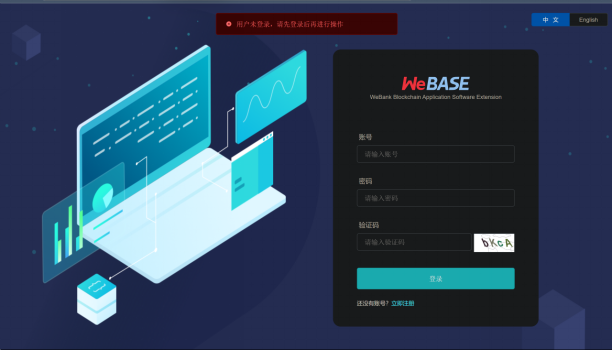
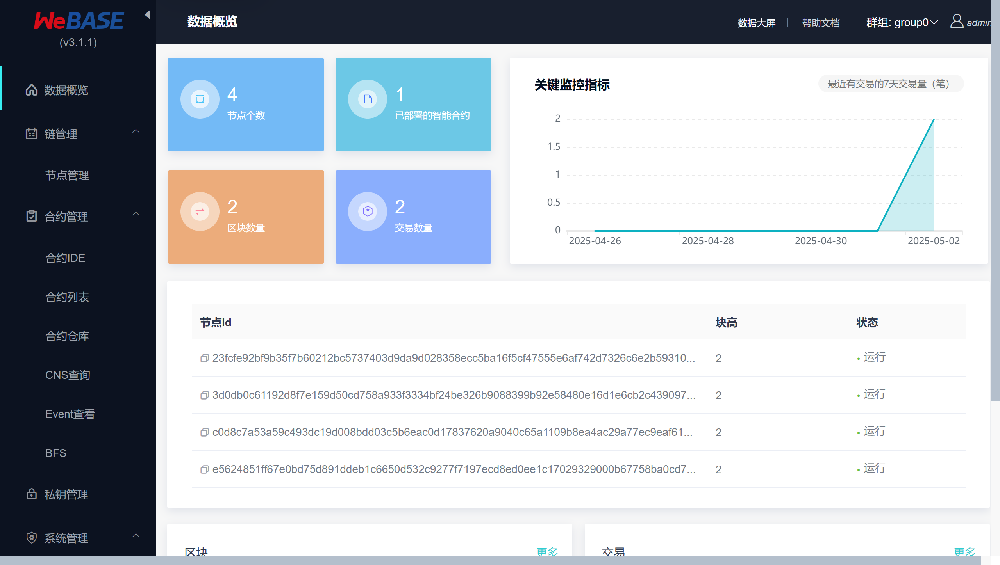
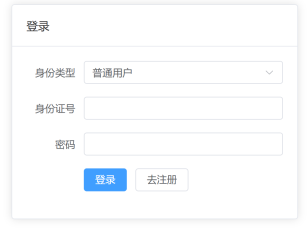
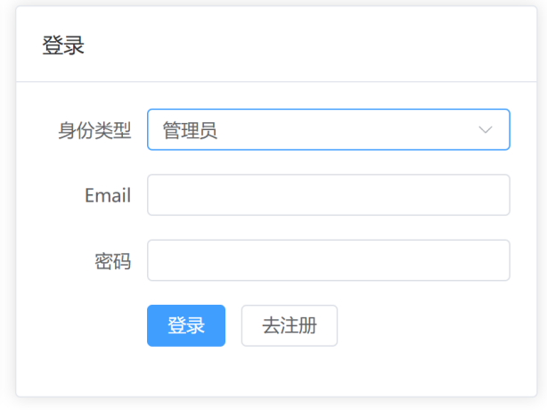
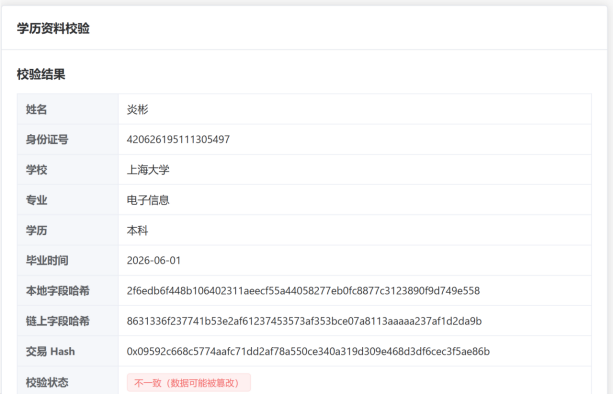
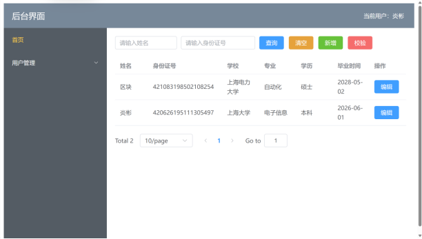

**基于区块链的可信学历管理系统搭建**
****
本项目基于 FISCO BCOS 3.0 区块链平台，构建了一个具备数据上链、校验等功能的学历信息管理系统。
**项目演示**
1. webase界面 
 
 
2. 登录界面 
 
 
3. 用户界面 
 
4. 管理员界面 
 

**项目架构** 
 
**系统模块** 
 

**参考**：
- [基于区块链的学历认证系统 | Hjl' Blog](https://huqianshan.github.io/contract/#%E5%9F%BA%E4%BA%8E%E5%8C%BA%E5%9D%97%E9%93%BE%E7%9A%84%E5%AD%A6%E5%8E%86%E8%AE%A4%E8%AF%81%E7%B3%BB%E7%BB%9F)
- [ethereum_blockchain: 基于以太坊区块链的学历查询系统](https://gitee.com/AidenX/ethereum_blockchain)
- [zhengcookie/MediTrust-Chain: 本项目是基于区块链技术的医疗健康管理系统，通过FISCO-BCOS联盟链实现医疗数据的安全存证与可信共享。](https://github.com/zhengcookie/MediTrust-Chain)
- [基于Java开发一套完整的区块链系统（附源码）-腾讯云开发者社区-腾讯云](https://cloud.tencent.com/developer/article/1776246)
- [基于区块链的物资管理系统: 物资管理系统区块链和web代码文件 - Gitee.com](https://gitee.com/think9876/mm/tree/master)
- [基于区块链技术的电子合同管理系统后台: SpringBoot Vue Hyperledger Fabric](https://gitee.com/henripoet/he_contract#https://gitee.com/link?target=https%3A%2F%2Fcloud.tencent.com%2Fdeveloper%2Farticle%2F1678190)
- https://www.bilibili.com/video/BV1Hk4y1Q78G/